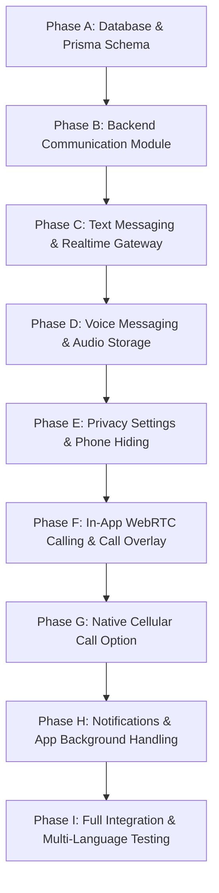

# YALLA VTC — Comprehensive Internal Ride Communication System Implementation Plan

A private, secure, in-app communication room between Passenger and Driver for active rides in Yalla VTC. Supports real-time text chat, voice audio messages, in-app WebRTC audio calls (phone number strictly hidden), optional cellular phone calls (governed by privacy settings), and multilingual (AR/FR/EN/ES) RTL/LTR user interfaces.

---

## User Review Required & Compliance Directives

> [!IMPORTANT]
> **Preserve Existing Architecture**: Zero refactoring or breaking changes to existing ride logic, authentication, Socket.IO infrastructure, notifications, or app navigation. All additions are modular and strictly additive.

> [!IMPORTANT]
> **Strict Server-Side Authorization**: Every REST endpoint and Socket.IO event validates that the authenticated user (`userId`) is either the assigned Passenger or Driver of the specified `rideId` in an active state (`DRIVER_ACCEPTED`, `ARRIVED`, `IN_PROGRESS`).

> [!IMPORTANT]
> **Privacy by Default**: `allowPhoneSharing` defaults to `false`. Real phone numbers are **NEVER** exposed unless the owner explicitly enables phone number sharing in their privacy settings.

> [!IMPORTANT]
> **WebRTC Signaling vs Media Transport**: Socket.IO is strictly used for signaling events (`call:initiate`, `call:signal`, `call:accept`, `call:decline`, `call:end`). Socket.IO is **NEVER** used to stream raw microphone audio. WebRTC media transport handles real-time P2P voice calls using free/open-source STUN/TURN architecture.

---

## Existing Files Reused vs New Files

### Existing Files Reused
- **[socket.gateway.ts](file:///Users/benomar/VTC%20OLD/atlas%20projet%20vtc%20%20/apps/backend-api/src/modules/realtime/presentation/gateways/socket.gateway.ts)**: Reuses `WSAuthMiddleware` and `SocketGateway.server` for event broadcasting.
- **[schema.prisma](file:///Users/benomar/VTC%20OLD/atlas%20projet%20vtc%20%20/apps/backend-api/prisma/schema.prisma)**: Existing `User`, `Driver`, and `Ride` models linked to new communication entities.
- **[PassengerHomeScreen.tsx](file:///Users/benomar/VTC%20OLD/atlas%20projet%20vtc%20%20/apps/driver-app/src/features/passenger/screens/PassengerHomeScreen.tsx)**: Integrates Communication entry point icons (💬 Chat, 📞 Call) on active ride cards.
- **[TripDetailScreen.tsx](file:///Users/benomar/VTC%20OLD/atlas%20projet%20vtc%20%20/apps/driver-app/src/features/orders/screens/TripDetailScreen.tsx)**: Integrates Communication entry point icons on Driver active trip card.

### New Files to Create

#### Backend (`apps/backend-api/src/modules/communication`)
1. `apps/backend-api/src/modules/communication/communication.module.ts`
2. `apps/backend-api/src/modules/communication/presentation/communication.controller.ts`
3. `apps/backend-api/src/modules/communication/application/communication.service.ts`
4. `apps/backend-api/src/modules/communication/presentation/communication.gateway.ts`

#### Frontend (`apps/driver-app/src/features/communication`)
5. `apps/driver-app/src/features/communication/screens/RideCommunicationModal.tsx`
6. `apps/driver-app/src/features/communication/components/InAppCallOverlay.tsx`
7. `apps/driver-app/src/features/communication/components/CallOptionModal.tsx`
8. `apps/driver-app/src/features/communication/components/VoiceMessageRecorder.tsx`
9. `apps/driver-app/src/features/communication/components/VoiceMessagePlayer.tsx`
10. `apps/driver-app/src/features/communication/services/communication.service.ts`
11. `apps/driver-app/src/features/communication/services/communicationSocket.ts`
12. `apps/driver-app/src/features/communication/services/webrtcCall.service.ts`

---

## 1. Database Schema Changes (`schema.prisma`)

```prisma
// 1. Add privacy setting to User model
model User {
  // ... existing fields
  allowPhoneSharing Boolean @default(false) // Default: Privacy ON (phone hidden)
  // ... relations
}

// 2. Communication Domain Models
model RideConversation {
  id          String        @id @default(uuid())
  rideId      String        @unique
  ride        Ride          @relation(fields: [rideId], references: [id], onDelete: Cascade)
  passengerId String
  driverId    String
  status      String        @default("ACTIVE") // ACTIVE, READ_ONLY, CLOSED
  createdAt   DateTime      @default(now())
  updatedAt   DateTime      @updatedAt
  closedAt    DateTime?

  messages    RideMessage[]
  callSessions RideCallSession[]

  @@index([passengerId])
  @@index([driverId])
}

model RideMessage {
  id             String           @id @default(uuid())
  conversationId String
  conversation   RideConversation @relation(fields: [conversationId], references: [id], onDelete: Cascade)
  senderId       String
  senderRole     UserRole
  type           MessageType      @default(TEXT)
  text           String?          @db.Text
  mediaUrl       String?          // Internal storage reference for audio file
  mimeType       String?          // audio/m4a, audio/aac
  durationSec    Int?             // Voice recording length in seconds
  status         MessageStatus    @default(SENT)
  createdAt      DateTime         @default(now())
  readAt         DateTime?

  @@index([conversationId])
}

model RideCallSession {
  id             String            @id @default(uuid())
  conversationId String
  conversation   RideConversation  @relation(fields: [conversationId], references: [id], onDelete: Cascade)
  callerId       String
  receiverId     String
  callType       CallType          @default(IN_APP)
  status         CallStatus        @default(RINGING)
  startedAt      DateTime          @default(now())
  answeredAt     DateTime?
  endedAt        DateTime?
  durationSec    Int?

  @@index([conversationId])
}

enum MessageType {
  TEXT
  VOICE
}

enum MessageStatus {
  SENDING
  SENT
  DELIVERED
  READ
  FAILED
}

enum CallType {
  IN_APP
  CELLULAR_PHONE
}

enum CallStatus {
  RINGING
  ACCEPTED
  DECLINED
  MISSED
  ENDED
  FAILED
}
```

---

## 2. Backend Architecture & REST/Socket Specification

### Protected REST API Endpoints
- `GET /communication/rides/:rideId` -> Validates user membership in ride, returns conversation details + recipient privacy state (`allowPhoneSharing`).
- `GET /communication/rides/:rideId/messages` -> Returns paginated message history.
- `POST /communication/rides/:rideId/messages` -> Send text message.
- `POST /communication/rides/:rideId/voice` -> Upload voice audio recording file (multipart form).
- `GET /communication/voice/:messageId` -> Protected audio streaming endpoint. Validates auth & ride participant before serving audio file.
- `PATCH /communication/privacy` -> Update authenticated user's `allowPhoneSharing` boolean.

### Real-Time Socket.IO Signaling Events (`communication.gateway.ts`)
- `room:join` (`ride:room:<rideId>`) -> Validate user + ride membership server-side.
- `message:send` -> Persist message in DB, broadcast `message:new` & `message:delivered`.
- `message:read` -> Update `readAt`, broadcast `message:read`.
- `typing:start` / `typing:stop` -> Broadcast typing indicators.
- **WebRTC Call Signaling**:
  - `call:initiate` -> Create `RideCallSession` (status `RINGING`), emit `call:incoming` to receiver.
  - `call:signal` -> Relay SDP Offer, SDP Answer, or ICE Candidates to target peer room.
  - `call:accept` -> Update status `ACCEPTED`, emit `call:accepted`.
  - `call:decline` -> Update status `DECLINED`, emit `call:declined`.
  - `call:end` -> Update status `ENDED`, calculate duration, emit `call:ended`.

---

## 3. WebRTC Audio Call Architecture & Dependency Specification

- **Media Transport**: Real-time audio stream uses standard WebRTC P2P with Google's free public STUN servers (`stun:stun.l.google.com:19302`).
- **Dependencies**: Uses `react-native-webrtc` for native mobile WebRTC engine (open-source & free, zero 3rd-party paid subscriptions required).
- **Permissions**:
  - Android: `android.permission.RECORD_AUDIO`, `android.permission.MODIFY_AUDIO_SETTINGS`.
  - iOS: `NSMicrophoneUsageDescription`.
- **Call State Machine**: `IDLE` -> `OUTGOING` -> `RINGING` -> `ACCEPTED` -> `CONNECTED` -> `ENDED` / `DECLINED` / `MISSED` / `FAILED`.

---

## 4. Multi-Language (AR/FR/EN/ES) & RTL/LTR UI Specification

- All UI strings use existing `i18n` translation keys (`t('chat.placeholder')`, `t('call.in_app_call')`, etc.).
- **Arabic (RTL)**:
  - Chat bubbles, inputs, and Call Overlay use `flexDirection: 'row-reverse'`.
  - Back icons & message alignment respect Arabic RTL standards.
- **French / English / Spanish (LTR)**:
  - Standard LTR alignment (`flexDirection: 'row'`).

---

## 5. Phased Incremental Implementation Strategy



### Phase A: Database Schema & Migration
1. Update `schema.prisma` with `allowPhoneSharing`, `RideConversation`, `RideMessage`, `RideCallSession`.
2. Run `npx prisma db push` and `npx prisma generate`.

### Phase B: Backend Communication Module
1. Build `CommunicationService`, `CommunicationController`, and `CommunicationGateway`.
2. Register `CommunicationModule` in `app.module.ts`.

### Phase C: Text Messaging
1. Create `RideCommunicationModal.tsx` for chat UI.
2. Connect Socket.IO events for real-time text sending, delivery status, and typing indicators.

### Phase D: Voice Messages
1. Build `VoiceMessageRecorder.tsx` and `VoiceMessagePlayer.tsx`.
2. Implement secure upload `POST /communication/rides/:rideId/voice` and streaming `GET /communication/voice/:messageId`.

### Phase E: Privacy Settings
1. Add `Allow phone number sharing` switch in User Profile Settings.
2. Implement backend & frontend logic to hide phone numbers when `allowPhoneSharing === false`.

### Phase F: In-App WebRTC Calling
1. Build `InAppCallOverlay.tsx` full-screen call UI with call state machine.
2. Connect WebRTC signaling events over Socket.IO and establish P2P audio stream.

### Phase G: Native Cellular Call Option
1. Build `CallOptionModal.tsx` (🟣 Call via Yalla VTC vs 📱 Phone Call).
2. Wire native phone dialer (`Linking.openURL('tel:...')`) strictly when recipient sharing is enabled.

### Phase H: Notifications & Background Behavior
1. Trigger push notifications for missed messages/calls when user is outside the room or app is backgrounded.

### Phase I: Full Integration Testing & Multi-Language Validation
1. Verify AR (RTL), FR, EN, ES locales.
2. Conduct full end-to-end ride communication test between Passenger and Driver.
